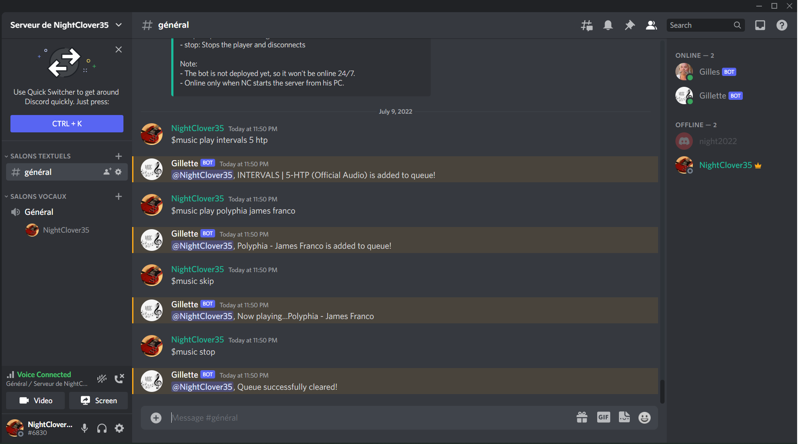

# Discord music bot - Featuring Lavalink and Discord.js

## The Challenge ⚡️

My friends challenged me to build a music discord bot for our server, and I thought it would be a very fun side project!

There are many options to fetch music with node.js such as using ffmpeg and the youtube API - but I went with Lavalink as it offers a more performant service.

Here was the challenge:

- Integrating typescript for bug-free code
- Installing lavalink server
- Using erela.js as a client for Lavalink
- Building a music command from scratch
- Building a playlist command from scratch
- Deploying the lavalink and node.js servers to digital ocean

## Built With ✨

- [Node.js](https://nodejs.org/) - JS runtime
- [Dicsord.js](https://discord.js.org) - JS library
- Erela.js - Lavalink client
- MongoDB - Document database
- Typescript

**Thanks for sharing** 🚀

